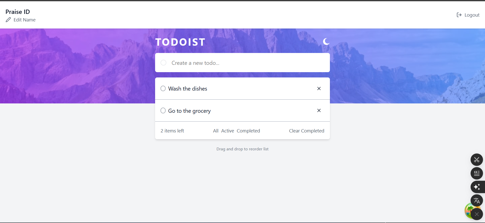
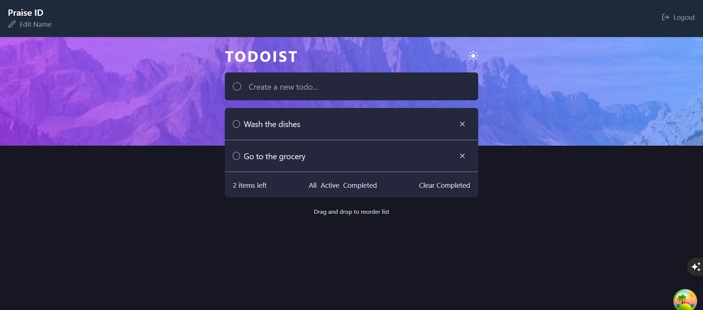
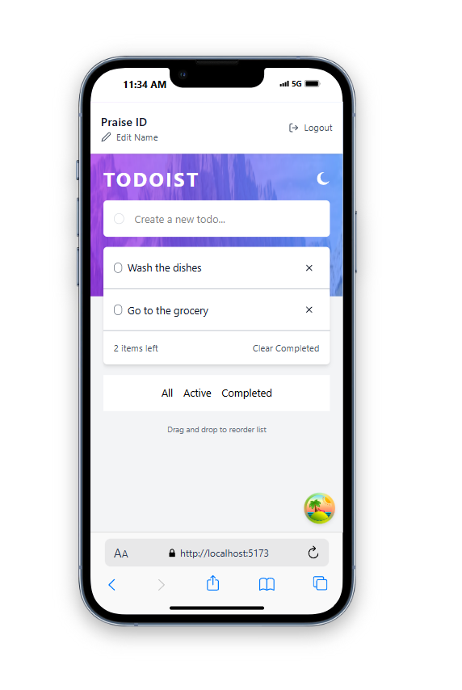
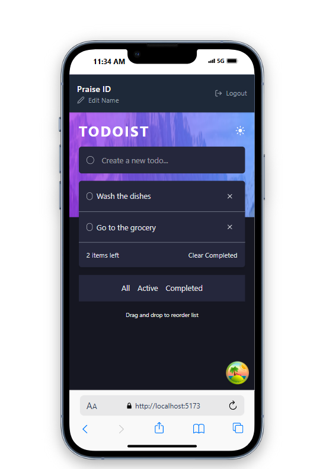

# Todoist TX 📝

A modern, feature-rich todo application built with React, TypeScript, and Supabase. This project provides a clean and intuitive interface for managing your daily tasks with advanced features like drag-and-drop reordering, dark/light theme support, and real-time synchronization.

## 📸 Screenshots

### Desktop Views
| Light Theme | Dark Theme |
|-------------|------------|
|  |  |

### Mobile Views
| Light Theme | Dark Theme |
|-------------|------------|
|  |  |

## ✨ Features

### Core Functionality
- **Create, Read, Update, Delete (CRUD) Operations** - Full todo management
- **Drag & Drop Reordering** - Intuitive task organization with @dnd-kit
- **Real-time Synchronization** - Data persistence with Supabase backend
- **User Authentication** - Secure login and registration system
- **Theme Support** - Dark and light mode toggle

### User Experience
- **Responsive Design** - Works seamlessly on desktop and mobile devices
- **Form Validation** - React Hook Form with comprehensive validation
- **Error Handling** - Graceful error boundaries and user feedback
- **Loading States** - Smooth loading indicators and optimistic updates
- **Toast Notifications** - Real-time feedback for user actions

### Technical Features
- **TypeScript** - Full type safety throughout the application
- **Modern React** - Built with React 19 and latest hooks
- **Performance Optimized** - React Query for efficient data fetching and caching
- **Modular Architecture** - Clean separation of concerns with custom hooks

## 🛠️ Tech Stack

### Frontend
- **React 19** - Latest React with concurrent features
- **TypeScript** - Type-safe development
- **Vite** - Fast build tool and dev server
- **Tailwind CSS** - Utility-first CSS framework
- **React Router DOM** - Client-side routing
- **React Hook Form** - Performant form handling
- **React Query** - Server state management
- **React Hot Toast** - Elegant toast notifications
- **React Error Boundary** - Error handling
- **React Icons** - Icon library

### Drag & Drop
- **@dnd-kit/core** - Modern drag and drop toolkit
- **@dnd-kit/sortable** - Sortable functionality

### Backend & Database
- **Supabase** - Backend-as-a-Service
  - PostgreSQL database
  - Real-time subscriptions
  - Authentication
  - Row Level Security (RLS)

### Development Tools
- **ESLint** - Code linting
- **TypeScript ESLint** - TypeScript-specific linting rules
- **Vite** - Development server and build tool

## 🚀 Getting Started

### Prerequisites
- Node.js (v18 or higher)
- npm or yarn
- Supabase account

### Installation

1. **Clone the repository**
   ```bash
   git clone https://github.com/praise002/Todoist.git
   cd Todoist
   ```

2. **Install dependencies**
   ```bash
   npm install
   ```

3. **Set up Supabase**
   - Create a new project at [supabase.com](https://supabase.com)
   - Create the following table in your Supabase dashboard:

   ```sql
   CREATE TABLE todos (
     id BIGSERIAL PRIMARY KEY,
     created_at TIMESTAMP WITH TIME ZONE DEFAULT NOW(),
     task TEXT NOT NULL,
     completed BOOLEAN DEFAULT FALSE,
     user_id UUID REFERENCES auth.users(id) ON DELETE CASCADE,
     order_position INTEGER DEFAULT 0
   );

   -- Enable Row Level Security
   ALTER TABLE todos ENABLE ROW LEVEL SECURITY;

   -- Create policies
   CREATE POLICY "Users can view their own todos" ON todos
     FOR SELECT USING (auth.uid() = user_id);

   CREATE POLICY "Users can create their own todos" ON todos
     FOR INSERT WITH CHECK (auth.uid() = user_id);

   CREATE POLICY "Users can update their own todos" ON todos
     FOR UPDATE USING (auth.uid() = user_id);

   CREATE POLICY "Users can delete their own todos" ON todos
     FOR DELETE USING (auth.uid() = user_id);
   ```

4. Put your supabase key and url in supabse.ts file

5. **Start the development server**
   ```bash
   npm run dev
   ```

6. **Open your browser**
   Navigate to `http://localhost:5173`

## 📱 Usage

### Getting Started
1. **Register** - Create a new account or login with existing credentials
2. **Add Todos** - Use the form to create new tasks
3. **Manage Tasks** - Mark as complete, edit, or delete tasks
4. **Reorder** - Drag and drop to reorganize your tasks
5. **Toggle Theme** - Switch between light and dark modes

### Features Overview
- **Add Tasks**: Click the input field and type your task
- **Complete Tasks**: Click the checkbox to mark tasks as done
- **Edit Tasks**: Click on a task to edit it inline
- **Delete Tasks**: Use the delete button to remove tasks
- **Reorder**: Drag tasks to reorder them according to priority

## 🏗️ Project Structure

```
src/
├── components/          # Reusable UI components
│   ├── BackgroundImage.tsx
│   ├── ErrorFallback.tsx
│   ├── Form.tsx
│   ├── ProtectedRoute.tsx
│   ├── Spinner.tsx
│   ├── TodoItem.tsx
│   └── TodoList.tsx
├── context/            # React context providers
│   ├── ThemeContext.tsx
│   └── ThemeProvider.tsx
├── hooks/              # Custom React hooks
│   ├── useCompletedTodos.ts
│   ├── useCreateTodo.ts
│   ├── useDeleteCompletedTodos.ts
│   ├── useDeleteTodo.ts
│   ├── useEditTodo.ts
│   ├── useLogin.ts
│   ├── useLogout.ts
│   ├── useSignUp.ts
│   ├── useTodos.ts
│   ├── useUpdateUser.ts
│   ├── useUser.ts
│   └── updateTodosOrder.ts
├── Layouts/            # Layout components
│   ├── AppLayout.tsx
│   ├── Footer.tsx
│   ├── Header.tsx
│   └── Navbar.tsx
├── pages/              # Page components
│   ├── Home.tsx
│   ├── Login.tsx
│   ├── Logout.tsx
│   └── Register.tsx
├── services/           # API and external services
│   ├── apiAuth.ts
│   ├── apiTodos.ts
│   └── supabase.ts
├── utils/              # Utility functions
│   ├── localStorage.ts
│   └── todos.ts
├── images/             # Static assets
├── App.tsx             # Main app component
├── main.tsx           # App entry point
└── types.ts           # TypeScript type definitions
```

## 🧪 Available Scripts

- `npm run dev` - Start development server
- `npm run build` - Build for production
- `npm run preview` - Preview production build
- `npm run lint` - Run ESLint

## 🔧 Configuration

### TypeScript Configuration
The project uses multiple TypeScript configuration files:
- `tsconfig.json` - Base configuration
- `tsconfig.app.json` - Application-specific settings
- `tsconfig.node.json` - Node.js specific settings

### ESLint Configuration
ESLint is configured with:
- React hooks rules
- React refresh rules
- TypeScript ESLint rules

### Vite Configuration
Vite is configured with:
- React plugin
- TypeScript support
- Tailwind CSS integration

## 🤝 Contributing

Contributions are welcome! Please feel free to submit a Pull Request.

### Development Guidelines
1. Follow the existing code style
2. Write meaningful commit messages
3. Add tests for new features
4. Update documentation as needed

## 📄 License

This project is licensed under the MIT License - see the [LICENSE](LICENSE) file for details.

## 🙏 Acknowledgments

- [React](https://reactjs.org/) - UI library
- [Supabase](https://supabase.com/) - Backend platform
- [Tailwind CSS](https://tailwindcss.com/) - CSS framework
- [dnd kit](https://dndkit.com/) - Drag and drop library
- [React Query](https://tanstack.com/query) - Data fetching library

## 📞 Support

If you have any questions or run into issues, please open an issue on GitHub.

---

**Built with ❤️ using React and TypeScript**